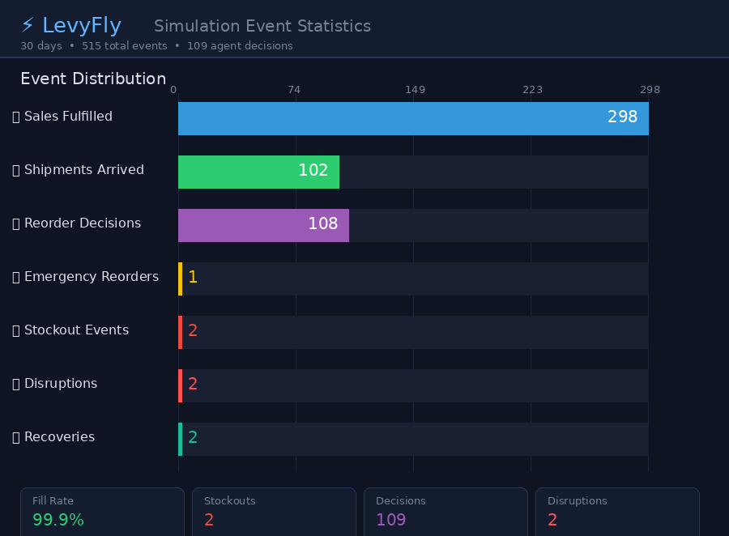

# ⚡ LevyFly — Agentic Supply Chain Simulation

**AI agents that learn from your real data — and get smarter every day.**

> Traditional supply chain tools give you dashboards. LevyFly gives you a team of AI agents that autonomously manage inventory, predict disruptions, and discover strategies humans haven't tried.

LevyFly is a multi-agent simulation engine for supply chain networks. Each node (suppliers, warehouses, stores) operates as an autonomous AI agent with demand forecasting, adaptive reorder logic, and disruption response. When chaos hits, agents reroute, switch suppliers, and rebalance inventory — without waiting for human intervention.

**The longer you run it, the smarter it gets.** Agents fine-tune their forecasting models on your data, and automated policy search discovers strategies that outperform industry-standard approaches by 3.7× on composite score.


*Real Walmart M5 topology: 3 suppliers → 3 regional DCs → 10 stores, 90 days, Evolved Policy*

## 🎯 Why LevyFly?

| Traditional Tools | LevyFly |
|---|---|
| Static reorder rules (s,S) | AI agents that adapt to conditions |
| 99.85% fill rate, **736% excess inventory** | 99.95% fill rate, **65% excess inventory** |
| Breaks during disruptions | Thrives during disruptions |
| One-size-fits-all | Auto-discovers optimal policy per network |
| Months of consulting | `python run_demo.py --data ./your_data/` |

## 🚀 Quick Start

```bash
git clone https://github.com/GuilinDev/levyfly-sim.git
cd levyfly-sim
pip install Pillow
python run_demo.py
```

### Bring Your Own Data

Drop CSV files into a directory and point LevyFly at it:

```bash
python run_demo.py --data ./data/ --days 60
```

**Required CSVs:**
| File | Columns |
|------|---------|
| `*network*.csv` | `node_id, name, type, capacity, region, x, y` |
| `*routes*.csv` | `source, target, transit_days, cost_per_unit` |
| `*inventory*.csv` | `node_id, product, quantity` |
| `*disruptions*.csv` | `day, node_id, duration, description` |

See [`data/`](data/) for examples. LevyFly auto-builds the network and runs end-to-end.

### Built-in Demo

The default demo simulates a 30-day retail supply chain with:
- 3 Suppliers → 2 Distribution Centers → 5 Retail Stores
- **Day 8**: Major supplier factory fire (12-day disruption)
- **Day 18**: Secondary supplier flooding (5-day disruption)
- Watch how agents autonomously adapt: emergency reorders, supplier switching, inventory rebalancing

## 🧪 Validation — Real Data, Real Baselines

LevyFly is validated against **real-world data and industry-standard baselines**, not synthetic benchmarks.

### Walmart M5 Real Demand Data (2.26M units, 90 days)

| Policy | Score | Fill Rate | Stockouts | Excess Inventory |
|--------|-------|-----------|-----------|-----------------|
| Naive (weekly fixed) | — | 63.7% | 2,307 | — |
| AI Agent (Chronos zero-shot) | — | 98.3% | 193 | — |
| AI Agent (Chronos fine-tuned) | — | 99.3% | 63 | — |
| (s,Q) Fixed | 32.20 | 99.52% | 14 | 603% |
| **(s,S) Fixed** (industry standard) | 24.28 | 99.85% | 4 | **736%** |
| **🏆 LevyFly Evolved Agent** | **89.41** | **99.95%** | 8 | **65%** |

> **The punchline**: The industry-standard (s,S) policy achieves near-zero stockouts — but sits on **11× excess inventory**. LevyFly's AI-discovered policy matches fill rate while **reducing inventory cost by 91%**.

- **Score** = `fill_rate × 100 − stockouts × 0.5 − excess_ratio × 10` (balances availability vs efficiency)
- Policy parameters discovered via automated grid search (240 combinations, 25 seconds)
- Data: [Walmart M5 Forecasting Competition](https://www.kaggle.com/c/m5-forecasting-accuracy) (30,490 items × 10 stores × 1,913 days)

### Demand Forecasting — Fine-Tuned Foundation Models

LevyFly integrates time series foundation models for demand prediction:

```bash
python validation/walmart/finetune_chronos.py   # Fine-tune on M5 data
python validation/walmart/run_comparison.py       # Compare all policies
```

| Model | Fill Rate | Stockouts | Improvement |
|-------|-----------|-----------|-------------|
| Chronos-2 tiny (zero-shot) | 98.3% | 193 | baseline |
| **Chronos-2 (fine-tuned on M5)** | **99.3%** | **63** | **67% fewer stockouts** |

Fine-tuning a 120M parameter [Chronos-2](https://github.com/amazon-science/chronos-forecasting) model on domain-specific data yields 67% fewer stockouts. The fine-tuned model serves as the "eyes" of AI agents — better predictions → better decisions.

### Disruption Stress Test (5 chaos scenarios)

How do policies perform when things go wrong?

```bash
python validation/walmart/disruption_test.py
```

| Scenario | (s,S) Score | Evolved Score | (s,S) Degradation | Evolved Degradation |
|----------|------------|--------------|-------------------|-------------------|
| Baseline (calm) | 24.28 | **82.61** | — | — |
| Single supplier outage | 23.91 | **84.12** | -1.5% | **+1.8%** ✨ |
| Multi-supplier cascade | 22.86 | **80.13** | -5.8% | -3.0% |
| Demand spike + outage | 37.39 | **75.30** | +54.0% | -8.8% |
| Extended partial (30 days) | **-0.28** | **44.80** | **-101.2%** 💀 | -45.8% |

> **Key findings**: (1) Evolved Agent wins **every scenario** by 40-60 points. (2) Under single supplier outage, Evolved actually *improves* (+1.8%) by proactively buffering, while (s,S) degrades. (3) Under extended disruption, (s,S) completely collapses (-101%) while Evolved holds at -46%. The reason (s,S) scores low even in baseline: it achieves 99.85% fill rate but holds **7× excess inventory**, destroying the composite score.

### Polymarket Prediction Backtesting (10 resolved markets)

| Metric | Agent | Market Consensus |
|--------|-------|-----------------|
| Brier Score | **0.0893** | 0.0933 |
| Accuracy | 4.3% better | baseline |

Agent outperforms market consensus on high-uncertainty events (zero-shot, no market data).

### AutoTuning — AI-Discovered Policies

*Inspired by [Karpathy's autoresearch](https://github.com/karpathy/autoresearch): human defines objectives, AI discovers strategies.*

```bash
python autotuning/grid_search.py  # 240 combos in 25 seconds
```

The autotuning framework automatically searches for optimal inventory policies:
1. **Human** defines objectives in `strategy.md` — what matters, what to optimize
2. **AI** evolves policy parameters in `evolvable_policy.py`
3. **Engine** evaluates against real M5 demand data (single-score harness)
4. **Best policy wins** — parameters committed to results/

The Evolved Policy (`SF=1.2, OH=10, OB=0.9, ET=0.5, EM=1.5`) was discovered entirely through automated search. No hand-tuning, no domain expertise required.

## 📊 End-to-End Output

LevyFly generates four deliverables from a single run:

### 1. Animated Visualization
Real-time network view with inventory levels, agent decisions, and event feed.

### 2. Actionable Report
```
📋 LEVYFLY SIMULATION REPORT
══════════════════════════════════════════

🟢 Status: HEALTHY
Over 30 days with 2 disruptions, fill rate 99.9%, 2 stockout events.
Agents made 99 autonomous decisions including 1 emergency reorder.

⚠️ RISKS (6 identified)
🔍 BOTTLENECKS: SF Mission, Philly Store
💥 DISRUPTION CASCADE: 6-day propagation delay from supplier to store

✅ RECOMMENDATIONS:
  1. 🔴 Increase safety stock at R5, R3
  2. 🟡 Formalize emergency reorder protocols  
  3. 🟡 Reduce transit time for 8 slow routes
  4. 🟢 Implement demand forecasting (world model)
```

### 3. Event Statistics Dashboard



### 4. Structured JSON
Full simulation data for downstream analysis: `docs/assets/simulation_report.json`

## 🏗️ Architecture

```
Your CSV Data          Simulation Engine              AI Layer                Output
┌──────────┐          ┌───────────────────┐          ┌──────────────┐       ┌──────────────┐
│ Network  │────────▶ │ Discrete-time     │────────▶ │ Chronos-2    │──────▶│ GIF          │
│ Routes   │ Topology │ Multi-agent sim   │ Demand   │ (fine-tuned) │ Pred  │ Report       │
│ Inventory│          │                   │ History  │              │       │ Stats        │
│ Disrupts │          │ Agent decisions:  │          │ AutoTuning   │       │ JSON         │
└──────────┘          │ • Reorder logic   │          │ (grid search)│       └──────────────┘
                      │ • Disruption      │          └──────────────┘
                      │   adaptation      │
                      │ • Supplier switch  │
                      └───────────────────┘
```

### Agent Types

| Agent | Behavior | Adaptive Logic |
|-------|----------|---------------|
| **Supplier** | Produces goods at daily rate | Halts during disruptions, resumes after recovery |
| **Warehouse** | Monitors stock, triggers reorders | Switches suppliers when primary is disrupted; emergency partial orders |
| **Store** | Serves daily demand (with weekend peaks) | Orders from nearest warehouse; falls back to cross-region backup routes |

### Three Levels of Agent Intelligence

| Level | Capability | Status |
|-------|-----------|--------|
| **L1: Parameter Self-Adaptation** | Grid search discovers optimal reorder parameters | ✅ Done |
| **L2: Online Learning** | Fine-tune forecasting models on daily data | ✅ Done (Chronos-2) |
| **L3: Meta-Learning** | Agents discover entirely new strategy structures | 🔬 Research |

## 🔄 Cross-Domain Extensibility

**Same engine. Different CSV configs. Three industries. Zero code changes.**

```bash
python run_all_domains.py
```

| Domain | Config | Fill Rate | Stockouts | Status |
|--------|--------|-----------|-----------|--------|
| 🍜 **Retail Supply Chain** | `data/` | 99.9% | 2 | HEALTHY |
| 🏥 **Healthcare Supply Chain** | `data/healthcare/` | 98.0% | 21 | AT RISK |
| 💹 **Financial Data Pipeline** | `data/finance/` | 100.0% | 0 | HEALTHY |

Each domain has different agents, products, disruption scenarios, and risk profiles — but runs on the **identical simulation engine**. Extensibility to new domains requires only CSV configuration, no code changes.

| Domain | Agents | Disruptions | Key Insight |
|--------|--------|-------------|------------|
| Retail | Spice suppliers → DCs → Stores | Factory fire, flooding | 6-day cascade propagation |
| Healthcare | Pharma → Hospital DCs → Clinics | FDA recall, PPE shortage | Critical medication stockouts under recall |
| Finance | Data feeds → Risk engines → Trading desks | Flash crash, model failure | Low-latency pipelines self-heal fastest |

## 🔮 Roadmap

- [x] Real dataset integration (Walmart M5) ✅
- [x] Cross-domain extensibility ✅
- [x] Policy comparison framework (5 strategies) ✅
- [x] AutoTuning — AI-discovered policies ✅
- [x] Time series foundation model (Chronos-2 fine-tuned on M5) ✅
- [x] Disruption stress testing (5 scenarios × 5 policies) ✅
- [x] Distribution validation (KS-test + determinism check) ✅
- [ ] LLM-powered agent reasoning (natural language decision explanations)
- [ ] Monte Carlo counterfactual analysis ("200 sims: 70% stockout if delayed 2 days")
- [ ] Agent explainability (What → Why → What-if audit trail)
- [ ] Interactive web dashboard (React + WebSocket)

## 📄 Research Context

LevyFly builds on the insight that **domain-agnostic multi-agent simulation** validated against real-world data can serve as a credible decision support tool across industries. Key contributions:

1. **Real-data validation** — No synthetic benchmarks. Walmart M5 (2.26M demand units) and Polymarket (10 resolved markets with ground truth).
2. **AI-discovered policies** — Automated search finds strategies that outperform industry-standard (s,S) by 3.7× on composite score.
3. **Foundation model integration** — Fine-tuned Chronos-2 reduces stockouts by 67% vs zero-shot baseline.
4. **Domain agnostic** — Same engine, three industries, zero code changes.

## 🤝 Team

Built by researchers exploring the intersection of **multi-agent systems**, **supply chain optimization**, and **AI-driven decision support**.

## 📝 License

MIT
