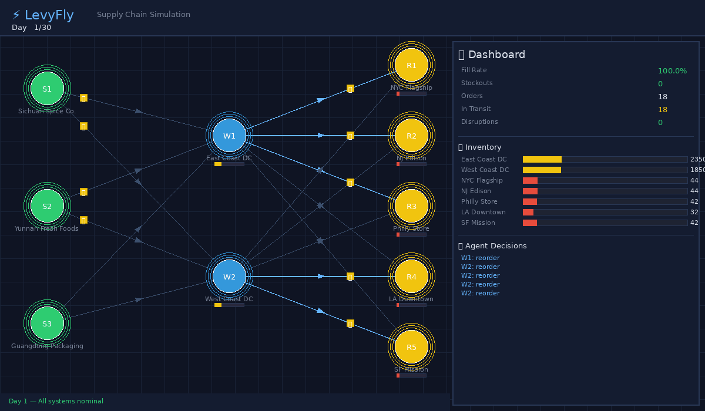

# ⚡ LevyFly — Agentic Supply Chain Simulation

**AI agents simulate your entire supply chain — predict disruptions before they cost you money.**

LevyFly is a multi-agent simulation engine for supply chain networks. Each node in your supply chain (suppliers, warehouses, retail stores) operates as an autonomous AI agent with its own inventory management logic, demand forecasting, and adaptive decision-making. When disruptions hit, agents automatically reroute, find alternative suppliers, and optimize inventory — just like a real supply chain team would.



## 🎯 What It Does

Drop in your supply chain topology and demand data. LevyFly builds a digital twin where autonomous agents:

- **Monitor** inventory levels and demand patterns in real-time
- **Decide** when and how much to reorder based on local conditions
- **Adapt** to disruptions by switching suppliers and rerouting shipments
- **Predict** cascade failures before they reach your customers

## 🚀 Quick Start

```bash
git clone https://github.com/GuilinDev/levyfly-sim.git
cd levyfly-sim
pip install Pillow
python run_demo.py
```

### Bring Your Own Data

Drop CSV files into a directory and point LevyFly at it:

```bash
python run_demo.py --data ./data/ --days 60
```

**Required CSVs:**
| File | Columns |
|------|---------|
| `*network*.csv` | `node_id, name, type, capacity, region, x, y` |
| `*routes*.csv` | `source, target, transit_days, cost_per_unit` |
| `*inventory*.csv` | `node_id, product, quantity` |
| `*disruptions*.csv` | `day, node_id, duration, description` |

See [`data/`](data/) for examples. That's it — LevyFly auto-builds the network and runs end-to-end.

### Built-in Demo

The default demo simulates a 30-day retail supply chain with:
- 3 Suppliers → 2 Distribution Centers → 5 Retail Stores
- **Day 8**: Major supplier factory fire (12-day disruption)
- **Day 18**: Secondary supplier flooding (5-day disruption)
- Watch how agents autonomously adapt: emergency reorders, supplier switching, inventory rebalancing

## 📊 End-to-End Output

LevyFly generates three deliverables from a single run:

### 1. Animated Visualization
Real-time network view with inventory levels, agent decisions, and event feed.

### 2. Actionable Report
```
📋 LEVYFLY SIMULATION REPORT
══════════════════════════════════════════

🟢 Status: HEALTHY
Over 30 days with 2 disruptions, fill rate 99.9%, 2 stockout events.
Agents made 99 autonomous decisions including 1 emergency reorder.

⚠️ RISKS (6 identified)
🔍 BOTTLENECKS: SF Mission, Philly Store
💥 DISRUPTION CASCADE: 6-day propagation delay from supplier to store

✅ RECOMMENDATIONS:
  1. 🔴 Increase safety stock at R5, R3
  2. 🟡 Formalize emergency reorder protocols  
  3. 🟡 Reduce transit time for 8 slow routes
  4. 🟢 Implement demand forecasting (world model)
```

### 3. Structured JSON
Full simulation data for downstream analysis: `docs/assets/simulation_report.json`

| Metric | Value |
|--------|-------|
| Simulation Period | 30 days |
| Fill Rate | 99.9% (despite 2 major disruptions) |
| Stockout Events | 2 (contained by agent intervention) |
| Emergency Reorders | 1 (autonomous supplier switching) |
| Agent Decisions | 99 total |
| Disruption Cascade | 6-day propagation delay |

## 🏗️ Architecture

```
Supply Chain Network          Simulation Engine          Visualization
┌─────────────┐              ┌──────────────────┐       ┌──────────────┐
│ Suppliers    │──────────▶  │ Discrete-time    │──────▶│ Network View │
│ Warehouses   │  Topology   │ Multi-agent sim  │ State │ Dashboard    │
│ Stores       │              │                  │       │ Event Feed   │
│ Transport    │              │ Agent decisions: │       │ Animated GIF │
└─────────────┘              │ • Reorder logic  │       └──────────────┘
                              │ • Disruption     │
                              │   adaptation     │
                              │ • Supplier       │
                              │   switching      │
                              └──────────────────┘
```

### Agent Types

| Agent | Behavior | Adaptive Logic |
|-------|----------|---------------|
| **Supplier** | Produces goods at daily rate | Halts during disruptions, resumes after recovery |
| **Warehouse** | Monitors stock, triggers reorders | Switches suppliers when primary is disrupted; emergency partial orders |
| **Store** | Serves daily demand (with weekend peaks) | Orders from nearest warehouse; falls back to cross-region backup routes |

## 🔮 Roadmap

- [ ] LLM-powered agent reasoning (natural language decision explanations)
- [ ] Real dataset integration (Walmart M5, custom CSV import)
- [ ] Interactive web dashboard (React + WebSocket)
- [ ] World model for demand prediction
- [ ] Multi-scenario comparison (Monte Carlo simulation)
- [ ] Integration with LeRobot for physical warehouse automation

## 📄 Research Context

LevyFly builds on the insight that **domain-agnostic multi-agent simulation** can be applied across industries:

| Domain | Agents | Events | Metrics |
|--------|--------|--------|---------|
| **Supply Chain** (this repo) | Suppliers, warehouses, stores | Disruptions, demand spikes | Fill rate, stockouts |
| Healthcare | Caregivers, patients | Medical events, shift changes | Response time, care quality |
| Finance | Traders, market makers | Price shocks, news | Returns, risk exposure |

The same simulation framework, different domain configurations. See our upcoming research for formal evaluation.

## 🤝 Team

Built by researchers exploring the intersection of **multi-agent systems**, **simulation**, and **real-world decision optimization**.

## 📝 License

MIT
