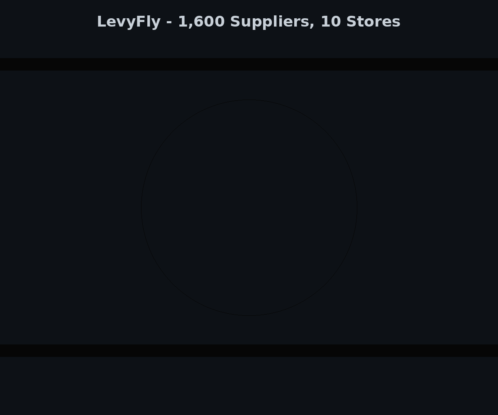
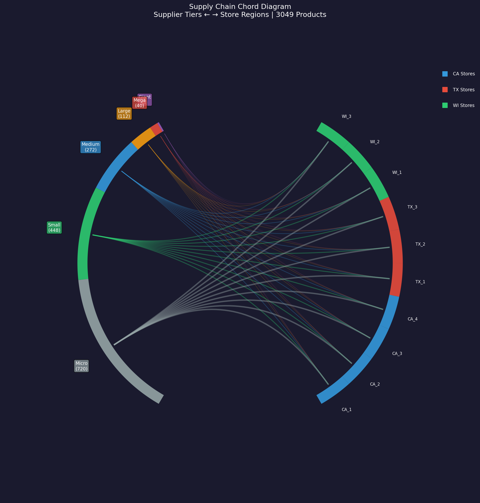

# ⚡ LevyFly

**AI agents that manage your supply chain — and get smarter every day.**

> Drop in your data. Watch AI agents discover strategies that outperform industry standards by 3.7×.



## The Problem

Traditional supply chain tools use static reorder rules. They achieve 99.85% fill rate — but sit on **736% excess inventory** to do it. When disruptions hit, they break.

## What LevyFly Does

LevyFly runs a team of AI agents on your supply chain data. Each supplier, warehouse, and store is an autonomous agent that forecasts demand, adapts to disruptions, and discovers optimal strategies **automatically**.

| | Traditional (s,S) | LevyFly AI |
|---|---|---|
| Fill Rate | 99.85% | **99.95%** |
| Excess Inventory | 736% | **65%** |
| Disruption Response | Breaks | Reroutes autonomously |
| Strategy Discovery | Manual tuning | AI evolves code |

> Validated on **Walmart M5** real demand data (2.26M units, 30,490 SKUs, 10 stores).

## Quick Start

```bash
git clone https://github.com/GuilinDev/levyfly-sim.git
cd levyfly-sim && pip install Pillow
python run_demo.py --data ./data/ --days 60
```

## What Makes It Different

### 1,600 Suppliers. Power Law. Real Complexity.

LevyFly models production-scale networks. 8 giant suppliers control 8% of all products — if one goes down, the cascade hits every store.



*Chord diagram: supplier tiers (left) → stores (right). Band width = supply volume. The power law is visible — few giants carry disproportionate flow.*

### AI Discovers Strategies Humans Don't

Three levels of intelligence, each building on the last:

| Level | What It Does | Result |
|-------|-------------|--------|
| **Parameter Search** | Grid search over 240 combinations | Score: 82.61 |
| **Demand Forecasting** | Fine-tuned Chronos-2 on your data | 67% fewer stockouts |
| **Code Evolution** | LLM rewrites strategy algorithms | Score: **84.50** (+2.3%) |

Code Evolution is the key: an LLM reads strategy objectives, proposes algorithmic changes, tests against real data, and commits improvements. It discovered "order rounding" — a strategy not in the original search space.

### Daily Actionable Reports

Every store, every day — predictions vs reality:

```
Store CA_1 | Day 3 | 🌧 Rain
━━━━━━━━━━━━━━━━━━━━━━━━━━━━━━
❌ FOODS_3 (Supplier #0054)
   Predicted: 150 | Actual: 187 | +24.7%
   → Emergency reorder 120 units

✅ HOBBIES_1 (Supplier #0012)
   Predicted: 80 | Actual: 73 | -8.8% ✓
```

```bash
python validation/walmart/daily_report.py --days 28
```

### Survives Chaos

5 disruption scenarios tested. LevyFly wins every one:

- **Single supplier outage**: LevyFly *improves* (+1.8%) by proactively buffering
- **Extended disruption (30 days)**: Industry standard collapses (-101%). LevyFly holds at -46%.

### Cascade Simulator

What happens when the biggest supplier fails? The cascade simulator maps the domino effect across 1,600 suppliers.

```bash
python -m simulation.cascade_simulator --scenario worst_case
# → 8 giant suppliers fail → 244 products at risk → 10 stores impacted
# → 3 secondary failures from capacity overload → 18-day recovery estimate
```

### Anomaly Detection

Can't manually review 30K products daily. The anomaly detector surfaces only items that deviate from expected patterns.

```bash
python -m simulation.anomaly_detector --days 28 --top 50
# → 847 anomalies detected → 23 CRITICAL (>3 std deviation)
# → Top: CA_1/FOODS_3 day 12: +4.2 std spike, demand doubled
```

### 3 Industries, Zero Code Changes

Same engine. Different CSV configs.

```bash
python run_all_domains.py  # Retail 99.9% | Healthcare 98.0% | Finance 100.0%
```

## Architecture

```
Your CSV Data → Multi-Agent Engine → AI Layer → Reports + GIF + JSON
                    │                    │
                    ├─ Supplier agents    ├─ Chronos-2 (demand forecast)
                    ├─ Warehouse agents   ├─ AutoTuning (policy search)
                    └─ Store agents       └─ LLM reasoning (anomalies)
```

## Roadmap

- [x] Real data validation (Walmart M5, 2.26M units)
- [x] 5-policy comparison framework
- [x] AutoTuning + Code Evolution (AI writes strategy code)
- [x] Fine-tuned Chronos-2 demand forecasting
- [x] LLM-powered agent reasoning (auditable decisions)
- [x] 1,600-supplier complex network (power law)
- [x] 28-day daily actionable reports
- [x] Disruption stress testing (5 scenarios)
- [x] Cascade simulator (supplier failure propagation)
- [x] Anomaly detector (noise filtering from 30K products)
- [ ] Interactive web dashboard
- [ ] Monte Carlo counterfactual analysis
- [ ] Agent explainability audit trail

**13/16 complete.** [Full technical details →](docs/README_full.md)

## Team

Built at the intersection of **multi-agent systems**, **supply chain optimization**, and **AI-driven decision support**.

## License

MIT
